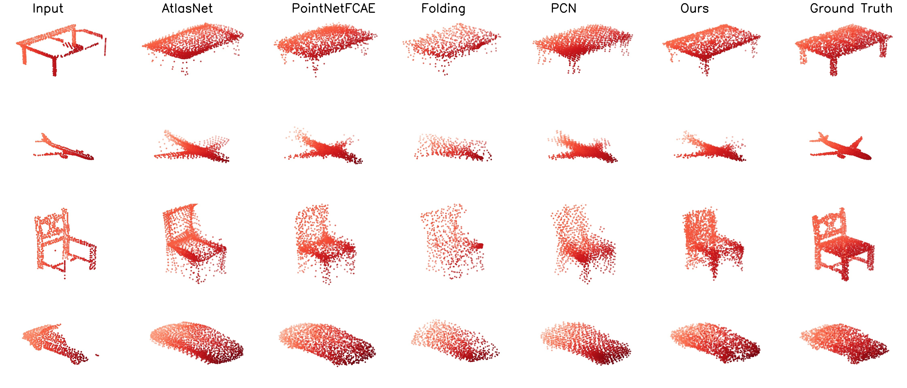

## completion3D: Stanford 3D Object Point Cloud Completion Benchmark & 
## TopNet: Structural Point Cloud Decoder

This repository contains source code for all methods used for the [Stanford 3D Object Point Cloud Completion Benchmark](https://completion3D.stanford.edu) and presented in the paper [TopNet: Structural Point Cloud Decoder, CVPR 2019](http://arxiv.org/abs/).


## Project Pages

The TopNet project page is available at [https://completion3D.stanford.edu/topnet](https://completion3D.stanford.edu/topnet).
The completion3D benchmark is available at [http://completion3D.stanford.edu](https://completion3D.stanford.edu/).

## Overview

The completion3D benchmark is a platform for evaluating state-of-the-art 3D Object Point Cloud Completion methods. This repository contains source code for various methods evaluated on the benchmark. Both **Tensorflow** and **Pytorch** are supported.

**3D Object Point Cloud Completion Results**: *A partial 3D point cloud is given as input and various methods used to generate a completed 3D point cloud*

## Benchmark submission instructions

To submit to the completion3d benchmark, set ```TRAIN=0``` and ```BENCHMARK=1``` in ```run.sh``` and run the script with parameters to evaluate. A ```submission.zip``` file will be generated by the script in the experiment output folder.

## Citing this work

If you find this work useful in your research, please consider citing:
```
@inproceedings{topnet2019,
  title={TopNet: Structural Point Cloud Decoder},
  author={Tchapmi, Lyne P and Kosaraju, Vineet and Rezatofighi, S. Hamid and Reid, Ian and Savarese, Silvio},
  booktitle = {The IEEE Conference on Computer Vision and Pattern Recognition (CVPR)},
  year={2019}
}

@inProceedings{yuan2018pcn,
  title     = {PCN: Point Completion Network},
  author    = {Yuan, Wentao and Khot, Tejas and Held, David and Mertz, Christoph and Hebert, Martial},
  booktitle = {3D Vision (3DV), 2018 International Conference on},
  year      = {2018}
}

@article{DBLP:journals/corr/ChangFGHHLSSSSX15,
  author    = {Angel X. Chang and Thomas A. Funkhouser and Leonidas J. Guibas and Pat Hanrahan and Qi{-}Xing Huang and Zimo Li and Silvio Savarese and Manolis Savva and Shuran Song and Hao Su and Jianxiong Xiao and Li Yi and Fisher Yu},
  title     = {ShapeNet: An Information-Rich 3D Model Repository},
  journal   = {CoRR},
  volume    = {abs/1512.03012},
  year      = {2015},
  url       = {http://arxiv.org/abs/1512.03012},
  archivePrefix = {arXiv},
  eprint    = {1512.03012},
  timestamp = {Mon, 13 Aug 2018 16:47:39 +0200},
  biburl    = {https://dblp.org/rec/bib/journals/corr/ChangFGHHLSSSSX15},
  bibsource = {dblp computer science bibliography, https://dblp.org}
}
```
And please refer to the [Shapenet Terms of Use](https://www.shapenet.org/terms)


## License

MIT License
